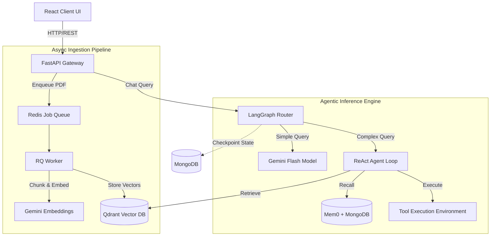

<div align="center">
  
  <h1>DocuMind AI</h1>
  <p><strong>Enterprise-Grade Agentic Document Intelligence Platform</strong></p>

  [](https://www.python.org/)
  [](https://fastapi.tiangolo.com/)
  [](https://react.dev/)
  [](https://vitejs.dev/)
  [](https://www.docker.com/)
  <br>
  [](https://www.langchain.com/)
  [](https://langchain-ai.github.io/langgraph/)
  [](https://qdrant.tech/)
  [](https://www.mongodb.com/)
  [](https://redis.io/)
  <br>
  [](https://deepmind.google/technologies/gemini/)
  [](https://openai.com/)
  [](https://github.com/mem0ai/mem0)
  [](#)
</div>

---

## 📖 Table of Contents
1. [The Problem & Our Solution](#-the-problem--our-solution)
2. [Architectural Paradigm](#-architectural-paradigm)
3. [Design Decisions & Trade-offs](#-design-decisions--trade-offs)
4. [Deep-Dive Code Explanation](#-deep-dive-code-explanation)
5. [Installation & Deployment](#-installation--deployment)
6. [Troubleshooting](#-troubleshooting)

---

## 🎯 The Problem & Our Solution

### What problem does this solve?
Modern enterprises are drowning in unstructured data (PDFs, reports, contracts). Traditional search engines rely on keyword matching, which fails to understand context, nuance, or complex multi-step queries. Furthermore, standard LLMs hallucinate when asked about proprietary data and cannot remember past interactions with specific users.

### The DocuMind AI Solution
DocuMind AI is an **Agentic Retrieval-Augmented Generation (RAG) platform** with persistent memory and conditional routing. 

It doesn't just "search" documents; it uses a **ReAct (Reason + Act)** loop to autonomously decide which tools to use, extract information from vector databases, synthesize answers, and store the context in a persistent knowledge graph for future reference.

---

## 🏗️ Architectural Paradigm

The system is built on a microservice-oriented, event-driven architecture, separating the ingestion pipeline from the inference engine.



---

## 🤔 Design Decisions & Trade-offs

Building a production system requires opinionated technical choices. Here is why we chose our specific stack and why we rejected alternatives.

### 1. Vector Database: Qdrant vs. Pinecone / Milvus
* **Why Qdrant?** Qdrant is written in Rust, extremely fast, runs locally via Docker (avoiding cloud vendor lock-in during dev), and natively supports rich payload filtering.
* **Why not Pinecone?** Pinecone is cloud-only. For an enterprise handling sensitive documents, an on-prem or VPC-deployable solution like Qdrant is strictly superior.

### 2. Workflow Orchestration: LangGraph vs. LangChain Agents / AutoGen
* **Why LangGraph?** LangGraph treats agent workflows as cyclic state machines (graphs). This allows us to implement **Conditional Routing** (fast models for simple queries, slow/reasoning models for complex ones) and **MongoDB Checkpointing** (pausing and resuming agent state per user thread).
* **Why not standard LangChain Agents?** Legacy `AgentExecutor` in LangChain is a black box. LangGraph gives us granular control over the control flow.

### 3. Asynchronous Processing: Redis RQ vs. Celery
* **Why Redis RQ?** RQ (Redis Queue) is lightweight, requires minimal boilerplate, and is perfectly suited for our PDF ingestion pipeline.
* **Why not Celery?** Celery is incredibly powerful but introduces massive operational overhead and complexity that is unnecessary for simple background document chunking/embedding.

### 4. Agent Architecture: Custom ReAct vs. Pre-built Agents
* **Why Custom ReAct?** By building our own `START → PLAN → TOOL → OBSERVE → OUTPUT` loop, we strictly control the LLM's JSON outputs via Pydantic, drastically reducing parsing errors and ensuring deterministic tool execution.

---

## 🧬 Deep-Dive Code Explanation

The codebase is structured following Domain-Driven Design (DDD) principles.

### `backend/app/main.py`
The API Gateway. We use FastAPI for its asynchronous capabilities (ASGI) and automatic OpenAPI schema generation. It handles CORS, mounts the routers, and manages the application lifecycle (e.g., creating upload directories on startup).

### `backend/app/agents/react_agent.py`
**The Core Brain.** This file implements the `ReactAgent` class.
* **Mechanics:** It uses a `while` loop (bounded by `max_iterations`) to parse the LLM's output into an `AgentStep` Pydantic model. 
* **Tool Dispatch:** If the LLM requests a tool, it dynamically looks it up in the `tools` dictionary, executes it securely, and feeds the `OBSERVE` result back into the message history.

### `backend/app/agents/langgraph_agent.py`
**The Routing Layer.** This implements a `StateGraph`.
* **State Management:** Uses `TypedDict` to maintain the conversation state (`messages`, `user_id`, `complexity`).
* **Routing Logic (`_route_by_complexity`):** Evaluates the user query. If it contains analytical keywords ("summarize", "compare"), it routes to the `detailed_chat_node`. Otherwise, it routes to `fast_chat_node`, saving latency and token costs.
* **Checkpointing:** Uses `MongoDBSaver` to persist the graph's state to MongoDB, allowing the agent to remember context across API calls.

### `backend/app/services/rag_service.py`
**The Knowledge Ingestion Engine.**
* **`index_pdf`:** Uses `PyPDFLoader` to parse text, `RecursiveCharacterTextSplitter` to create overlapping chunks (preventing context loss at page boundaries), and pushes to Qdrant.
* **`search`:** Performs semantic similarity search against Qdrant using `GoogleGenerativeAIEmbeddings`.
* **Tool Factory (`make_search_tool`):** Curries the search function to bind it to a specific collection, generating a tool the ReAct agent can use natively.

### `backend/app/services/memory_service.py`
**The Long-Term Memory.** Integrates the `mem0` library.
* **Mechanics:** Wraps interactions in a `save` method. Mem0 extracts entities and facts from the conversation and stores them in Qdrant. Before the agent answers, `search` retrieves these personalized facts, injecting them into the system prompt.

### `backend/app/workers/indexing_worker.py` & `queue_service.py`
**The Async Pipeline.** 
* Uploading a 50-page PDF takes time to embed. Instead of blocking the HTTP response, `queue_service` pushes a job to Redis. The worker process, running `indexing_worker.py`, consumes this job in the background, ensuring the API remains highly responsive.

### `frontend/src/components/ChatWindow.jsx`
**The Conversational Interface.** 
* A React component that manages message state. It renders markdown, syntax-highlights code, and includes a highly complex `<ThinkingSteps />` component that parses the ReAct agent's intermediate JSON outputs into a beautiful, collapsible "chain of thought" UI.

---

## 🚀 Installation & Deployment

This project uses Docker Compose to orchestrate the microservices.

### Prerequisites
* Docker & Docker Compose
* Node.js v18+ (for local frontend dev)
* Python 3.11+ (for local backend dev)

### 1. Environment Configuration
Create the environment file:
```bash
cp .env.sample .env
```
Populate `.env` with your credentials:
```ini
GEMINI_API_KEY=AIzaSyYourKeyHere...
# (Optional) For Voice TTS
OPENAI_API_KEY=sk-proj-YourKeyHere... 
```

### 2. Enterprise Deployment (Docker Compose)
To spin up the entire stack (Qdrant, MongoDB, Redis, FastAPI Backend, RQ Worker):
```bash
docker compose up --build -d
```
*The API will be available at `http://localhost:8000`*

### 3. Local Development Setup (Without Docker Backend)
If you want to run the code directly for debugging:

**Start Infrastructure:**
```bash
docker compose up qdrant mongodb redis -d
```

**Start Backend (Terminal 1):**
```bash
cd backend
python -m venv venv
source venv/bin/activate  # Windows: venv\Scripts\activate
pip install -r requirements.txt
uvicorn app.main:app --host 0.0.0.0 --port 8000 --reload
```

**Start RQ Worker (Terminal 2):**
```bash
cd backend
source venv/bin/activate
rq worker documind --url redis://localhost:6379
```

**Start Frontend (Terminal 3):**
```bash
cd frontend
npm install
npm run dev
```
*Access the UI at `http://localhost:5173`*

---

## 🛠️ Troubleshooting

### 1. Documents are stuck in "Queued" status
**Symptom:** You upload a PDF, but it never finishes indexing.
**Resolution:** The RQ Worker is not running or cannot connect to Redis. 
* Check docker logs: `docker compose logs worker`
* Ensure Redis is accessible at `redis://localhost:6379` (or the URL defined in your `.env`).

### 2. Agent returns "I reached the maximum reasoning steps"
**Symptom:** The LLM gets stuck in an infinite loop calling tools.
**Resolution:** This usually happens if a tool returns an error that the LLM doesn't know how to handle, causing it to retry endlessly. 
* Check backend logs for `Agent error at iteration X`.
* Ensure the Qdrant instance is reachable. If `_search_documents` fails continuously, the agent cannot complete the `PLAN`.

### 3. Voice / STT Features Failing
**Symptom:** Clicking the microphone throws a 503 error.
**Resolution:** The `SpeechRecognition` library relies on OS-level audio bindings (like `pyaudio`). If deployed in a slim Docker container without ALSA/PortAudio, it will fail gracefully.
* The frontend is designed to handle this by falling back to text-only mode. To enable locally, ensure you have C++ build tools installed before running `pip install pyaudio`.

---
<div align="center">
  <i>Engineered with 💡 and Architecture Best Practices.</i>
</div>
